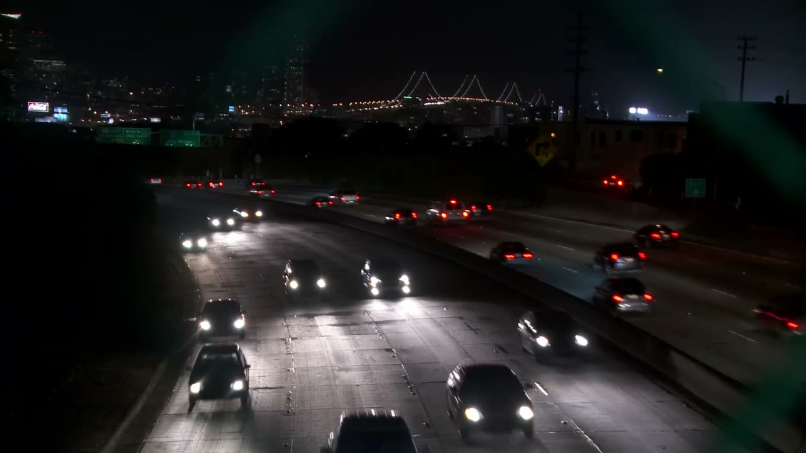

# Quan sát ảnh gốc bổ sung — frame_0187.jpg

**Trạng thái:** Đây là quan sát bổ sung do trợ lý AI thực hiện theo yêu cầu của học viên, sau khi học viên đã xem và sửa nhãn trong CVAT. Bản ghi này không phải quan sát độc lập của học viên trước khi xem nhãn AI và không thay thế bằng chứng thực hiện đúng thứ tự của bài thực hành.

- **Ảnh quan sát:** `frame_0187.jpg`, thuộc lô vòng 1, tại thời điểm 74,8 giây của video.
- **Nguồn quan sát:** ảnh gốc có kích thước 1280 × 720 pixel, không hiển thị khung nhãn hoặc dự đoán trong lần quan sát này.
- **Người thực hiện:** trợ lý AI; học viên chưa xác nhận lại nội dung dưới đây.
- **Thời điểm ghi bổ sung:** 2026-09-25T10:12:33+00:00 (UTC).

## 1. Số xe quan sát được

Ước lượng **khoảng 26 xe**, với khoảng bất định **25–28 xe**, tùy cách phân biệt các cụm đèn ở rất xa và xe bị cắt ở mép ảnh. Đây là số ước lượng từ ảnh gốc, không phải số đếm nhãn chuẩn.

Xe đi về phía máy quay tập trung ở nửa trái và phía dưới ảnh, có đèn pha trắng. Xe đi xa nằm chủ yếu ở nửa phải và phía trên, có đèn hậu đỏ. Một số cụm đèn ở xa không đủ rõ để xác định chắc chắn ranh giới của từng xe.

## 2. Các vị trí dễ bị bỏ sót hoặc vẽ sai

Tọa độ dưới đây được ước lượng bằng mắt, tính bằng pixel từ góc trên bên trái ảnh. Chúng mô tả vị trí cần kiểm tra, không phải tọa độ khung nhãn để nhập vào CVAT.

| Vị trí | Quan sát từ ảnh gốc | Nguy cơ và cách xử lý theo hướng dẫn gán nhãn |
| --- | --- | --- |
| Sát giữa mép dưới, quanh (590, 690) | Một phần thân và nóc xe tối bị cắt bởi đáy ảnh; không thấy đầy đủ đèn như những xe phía trên. | Dễ bỏ sót nếu chỉ tìm đèn sáng. Vẽ khung bao phần thân xe còn nằm trong ảnh, không suy diễn phần ngoài khung hình. |
| Sát mép phải, quanh (1240, 505) | Một phần xe đi xa có đèn hậu đỏ, bị cắt ở cạnh phải và nhòe do chuyển động. | Dễ bỏ qua hoặc vẽ khung vượt ra ngoài ảnh. Chỉ bao phần xe nhìn thấy và vùng nhòe thuộc thân xe. |
| Giữa ảnh, quanh (610, 440), cùng vùng đường sáng phía dưới | Xe đi về phía máy quay có đèn pha chói; ánh sáng kéo dài xuống mặt đường. | Dễ kéo khung theo vệt phản chiếu. Bao thân xe và đèn, không bao vùng mặt đường được chiếu sáng. |
| Vùng xa, khoảng x = 640–780 và y = 315–350 | Nhiều cụm đèn hậu đỏ ở gần nhau, trong khi thân xe tối. | Cần phóng to để tách từng xe, tránh gộp hai xe vào một khung. Với xe rất xa có khung cao dưới khoảng 16 pixel, áp dụng nhất quán quy tắc của bài thực hành. |

## 3. Giới hạn của bản ghi

Không tính biển báo, đèn cầu, đèn đường hoặc vệt phản chiếu là xe. Số đếm còn bất định ở vùng xa; học viên cần tự mở ảnh để kiểm tra và xác nhận.

Các nhận xét trên chỉ mô tả nguy cơ từ ảnh gốc. Chúng không khẳng định mô hình thực tế đã bỏ sót hoặc vẽ sai ở những vị trí này.

## 4. Trạng thái khóa bản ghi

Chưa có khóa gốc được tạo trước khi xem nhãn AI. Nếu khóa bản ghi bổ sung này ở thời điểm hiện tại, khóa chỉ xác nhận nội dung không thay đổi kể từ lần khóa mới; không chứng minh đã thực hiện quan sát trước khi xem nhãn AI.
