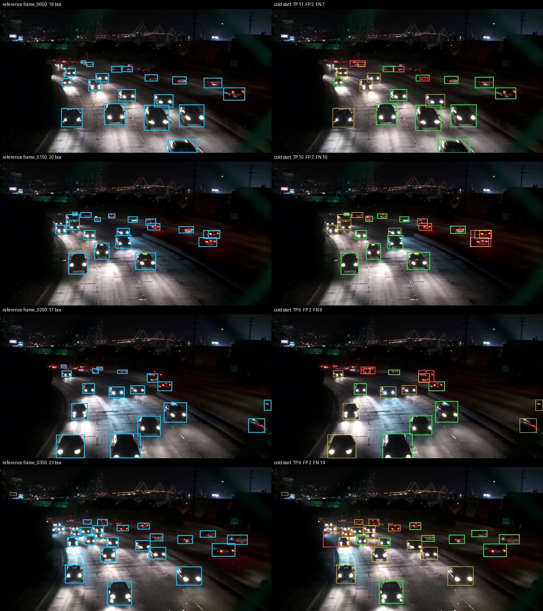
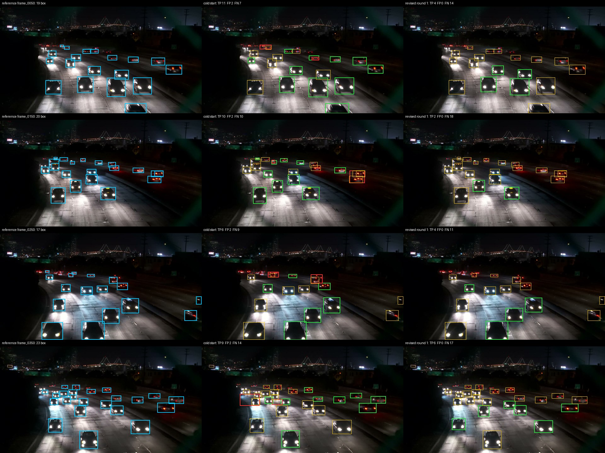

# Báo cáo Day 08 — Kiểm nhãn AI và một vòng học chủ động

**Học viên:** Nguyễn Hoàng Tùng — **2A202602314**. Công cụ gán nhãn: CVAT Docker local. Môi trường tính toán: Python 3.14.6, PyTorch 2.14.0+cpu, Ultralytics 8.4.161, thiết bị cpu.

**Kết quả chính:** Sau một vòng sửa nhãn và fine-tune, AP50 giảm từ **0.7714** thành **0.5106**, chênh lệch **-0.2608**, trên cùng 20 ảnh test. Báo cáo này sử dụng **12 ảnh, 321 box đã sửa và 50 epoch**, train mới từ pretrained. Toàn bộ bảng, hình và kết luận dưới đây thuộc checkpoint cuối của lần chạy **20260925_180654_361708**.

Trợ lý hỗ trợ chạy tính toán, đối chiếu và tổng hợp báo cáo từ file thực tế. Bản BLIND_SCAN hiện có là quan sát bổ sung của trợ lý sau khi học viên đã sửa CVAT. Khóa hợp lệ về hash không chứng minh quan sát độc lập trước AI; giới hạn này vẫn được công khai dù checker hình thức có thể đạt.

## 1. Dữ liệu và cách chia tập

Theo [DATA.md](../data/DATA.md), video cao tốc ban đêm được lấy mẫu 2,5 fps, ảnh 1280 × 720. Có 268 ảnh pool, 20 ảnh test và 112 ảnh vùng đệm/xen kẽ bị loại. Vòng 1 chọn 12 ảnh pool. Không đưa ảnh test vào train.

Chia ngẫu nhiên dễ khiến cùng xe ở các frame cách nhau 0,4 giây xuất hiện trong cả train và test, làm số đo lạc quan giả tạo. Tách theo thời gian với khoảng cách pool–test gần nhất 4,4 giây giảm rò rỉ, nhưng dữ liệu vẫn cùng camera và chưa kiểm chứng khả năng tổng quát sang cảnh khác.

Nhãn test do mô hình tạo, chưa được người rà từng box: 417 box gốc, 14 box cao dưới 16 px được bỏ qua, còn 403 box được chấm. IoU ghép là 0,5; precision/recall ở confidence 0,25; AP50 dùng dự đoán confidence từ 0,01. Cả 20 file test được kiểm SHA-256 với bản phát hành.

## 2. Mô hình khởi đầu lạnh

YOLOv8n pretrained COCO, gộp car/bus/truck (2, 5, 7) thành car của lab. Mốc này được giữ nguyên và kiểm lại trong lần chạy mới. Nguồn: [metrics_round0.json](../outputs/metrics_round0.json).

**Bảng 1. Kết quả mô hình khởi đầu lạnh**

| Chỉ số    | Giá trị |
| :-------- | ------: |
| AP50      | 0.7714  |
| Precision | 0.9249  |
| Recall    | 0.4888  |
| F1        | 0.6396  |
| TP        | 197     |
| FP        | 16      |
| FN        | 206     |

Recall xe nhỏ chỉ 0.1818, thấp hơn xe vừa (0.5473) và xe lớn (0.5610). Ảnh so sánh cho thấy vùng xe xa, thân tối và đèn chói cần kiểm kỹ. Khi chỉ thấy cụm đèn hoặc nghi một khung tham chiếu gộp nhiều xe, cần rà ảnh gốc trước khi kết luận model sai; không sửa nhãn test theo dự đoán.

## 3. Chiến lược chọn mẫu

Giữ nguyên lô đã chọn từ vòng 0, không chạy lại chọn mẫu sau khi đã thấy test. Công thức `score = 0,5U + 0,3A + 0,2D`: U là mức bất định của tối đa năm box khó nhất; A là số box mơ hồ đã chuẩn hóa; D là khoảng cách thời gian với ảnh đã gán. Vòng đầu D = 1 cho mọi ứng viên. `MIN_GAP_S = 2` giảm các ảnh gần trùng, không bảo đảm mỗi ảnh chứa xe khác nhau.

**Bảng 2. Các ảnh được cân nhắc khi chọn mẫu**

| Frame | Thứ hạng | Điểm chọn mẫu | Lý do cân nhắc                                   |
| ----: | -------: | ------------: | :----------------------------------------------- |
| 0182  | 1        | 0,9591        | Xe tối/cắt mép dưới cần rà; 18 box mơ hồ         |
| 0369  | 2        | 0,9324        | Cảnh đông, đèn pha chói; công rà cao             |
| 0326  | 4        | 0,9155        | Nhiều xe gần nhau và phản chiếu                  |
| 0372  | 6        | 0,9101        | Không chọn: chỉ cách 0369 1,2 giây, dưới min-gap |

[SELECTION.md](SELECTION.md) phân tích 50 ứng viên đầu và đề xuất top 5 theo ngân sách giả định: 0182, 0369, 0326, 0099, 0270. Đây là phân tích hồi cứu; thực nghiệm vẫn dùng đúng 12 ảnh thuật toán chọn. Bất định cao không bảo đảm lợi ích học; xe bị bỏ sót hoàn toàn có thể không góp vào điểm. Không có đối chứng random nên chưa chứng minh chiến lược này tốt hơn chọn ngẫu nhiên.

## 4. Vòng học chủ động và bản nhãn cập nhật

### 4.1. Nhãn đã sửa

**Bảng 3. Thống kê rà và sửa nhãn**

| Nội dung                      | Số lượng / tỷ lệ |
| :---------------------------- | ---------------: |
| Box gợi ý ban đầu (pre-label) | 169              |
| Box sau rà soát               | 321              |
| Giữ gần nguyên (accepted)     | 159              |
| Chỉnh khung (edited)          | 3                |
| Xóa khung (deleted)           | 7                |
| Thêm khung (added)            | 159              |
| Tỷ lệ giữ gần nguyên          | 94.08%           |

Nguồn: [round1_diff.md](../outputs/round1_diff.md), [REVIEW_LOG.csv](REVIEW_LOG.csv), [REVIEW_DETAILS.md](REVIEW_DETAILS.md). IoU ≥ 0,85 là accepted; từ 0,5 đến dưới 0,85 là edited. Một box kéo xa có thể thành một added cộng một deleted; không đồng nhất diff với lỗi FP/FN thực tế của nhãn AI.

Theo [cvat_export_audit.json](../outputs/cvat_export_audit.json), có 0/12 file thay đổi so với bản đóng gói trước lần chạy này. Nhãn train được ghi hash trước train và kiểm lại sau train. Ca xe tối sát đáy ảnh phải bao phần thân nhìn thấy; xe cắt mép không vẽ ra ngoài ảnh; hai xe gần nhau phải tách khung, không kéo khung theo vệt đèn. Đây là những quy tắc cần áp dụng nhất quán khi rà nhãn.

### 4.2. Cấu hình và nguồn gốc kết quả

**Bảng 4. Cấu hình huấn luyện và đánh giá**

| Tham số                        | Giá trị                                                                                 |
| :----------------------------- | :-------------------------------------------------------------------------------------- |
| Điểm xuất phát                 | YOLOv8n pretrained; train mới, không resume bản cũ                                      |
| Số ảnh train                   | 12                                                                                      |
| Số box train                   | 321                                                                                     |
| Epoch hoàn tất                 | 50 / 50                                                                                 |
| Kích thước đầu vào (imgsz)     | 960                                                                                     |
| Batch size                     | 16                                                                                      |
| Số worker                      | 0                                                                                       |
| Seed                           | 8                                                                                       |
| Optimizer                      | auto                                                                                    |
| Thời gian train                | 997.3 giây, chưa gồm suy luận và tạo báo cáo                                            |
| Checkpoint đánh giá            | last.pt; không chọn theo kết quả test                                                   |
| Validation trong lịch sử train | val=False; bước validation cuối của thư viện dùng ảnh train, không dùng làm metric test |

Nguồn: [training_round1.json](../outputs/training_round1.json), [train_history_round1.csv](../outputs/train_history_round1.csv). Notebook Run All tự kiểm export, đóng gói nhãn, train, đánh giá, sinh báo cáo và copy. Không cần chạy lại cold-start trên toàn bộ pool.

### 4.3. So sánh trên cùng test

**Bảng 5. So sánh kết quả trước và sau fine-tune**

| Chỉ số                            | Vòng 0 — Cold start | Vòng 1 — Fine-tune |
| :-------------------------------- | ------------------: | -----------------: |
| Số ảnh train                      | 0                   | 12                 |
| Số box train                      | 0                   | 321                |
| AP50                              | 0.7714              | 0.5106             |
| Chênh lệch AP50 so với cold start | —                   | -0.2608            |
| Precision                         | 0.9249              | 1.0000             |
| Recall                            | 0.4888              | 0.1985             |
| F1                                | 0.6396              | 0.3313             |

Vì chỉ có một vòng học chủ động, chênh lệch với vòng trước cũng là chênh lệch với cold start. Bảng gốc: [rounds_table.md](rounds_table.md).

**Bảng 6. Recall theo kích thước xe**

| Nhóm   | Recall vòng 0 | Recall vòng 1 | Chênh lệch |
| :----- | ------------: | ------------: | ---------: |
| Xe nhỏ | 0.1818        | 0.0000        | -0.1818    |
| Xe vừa | 0.5473        | 0.2128        | -0.3345    |
| Xe lớn | 0.5610        | 0.4146        | -0.1464    |

TP/FP/FN: **197/16/206 → 80/0/323**. Precision cần đọc cùng recall: ít dự đoán có thể giảm FP nhưng tăng bỏ sót. AP50 đổi **-0.2608**, không thể suy ra chất lượng chỉ từ loss train hoặc số box mới.

Ở confidence 0,25, mô hình sau train tìm được 80/403 box tham chiếu và bỏ sót 323; số TP giảm 117 so với cold start. Vì vậy mức precision 100.00% không bù được phần recall suy giảm. Lô train nhỏ, nhãn còn bất định và thay đổi tham số khi fine-tune là những khả năng cần kiểm tra, chưa phải nguyên nhân đã được chứng minh. Không thể kết luận chắc chắn overfitting chỉ từ hai số AP50.

Chẩn đoán độ tin cậy: trên 20 ảnh test có 339 dự đoán ở ngưỡng 0,01, confidence cao nhất 0.8369; 80 dự đoán đạt ngưỡng 0,25. Nguồn: [confidence_diagnostic_round1.json](../outputs/confidence_diagnostic_round1.json).

### 4.4. Ca test có thể đối chiếu

**Bảng 7. Các trường hợp trên tập test**

| Ảnh test       | TP: trước → sau | FP: trước → sau | FN: trước → sau |
| :------------- | :-------------: | :-------------: | :-------------: |
| frame_0050.jpg | 11 → 4          | 2 → 0           | 7 → 14          |
| frame_0150.jpg | 10 → 2          | 2 → 0           | 10 → 18         |
| frame_0250.jpg | 6 → 4           | 2 → 0           | 9 → 11          |
| frame_0350.jpg | 9 → 6           | 2 → 0           | 14 → 17         |

**Từ bỏ sót thành khớp:** frame_0350.jpg, tâm khoảng (892, 555) px, cỡ 121 × 87 px. Trạng thái tính ở confidence 0,25 và IoU 0,5 với nhãn tham chiếu; cần kiểm ảnh gốc trước khi coi đó là nhãn người chuẩn.

**Từ khớp thành bỏ sót:** frame_0350.jpg, tâm khoảng (564, 636) px, cỡ 117 × 113 px. Trạng thái tính ở confidence 0,25 và IoU 0,5 với nhãn tham chiếu; cần kiểm ảnh gốc trước khi coi đó là nhãn người chuẩn.

**Vẫn bỏ sót:** frame_0250.jpg, tâm khoảng (332, 664) px, cỡ 133 × 110 px. Trạng thái tính ở confidence 0,25 và IoU 0,5 với nhãn tham chiếu; cần kiểm ảnh gốc trước khi coi đó là nhãn người chuẩn.

Nguồn: [test_cases_round1.csv](../outputs/test_cases_round1.csv), [test_changes_round1.json](../outputs/test_changes_round1.json). Dự đoán được lưu và tính lại metric để bảo đảm khớp file kết quả. Nhãn train mới có thể thay đổi độ tin cậy và độ khít khung; một lần train không tách được tác động của nhãn, epoch và tối ưu hóa.

## 5. Kết luận và giới hạn

**Dừng ở vòng 1 cho bài nộp này.** Không tăng số vòng chỉ để tìm số test cao hơn. Nếu muốn chọn cấu hình, cần validation riêng và giữ test làm đánh giá cuối; lần này test đã được xem qua nhiều lần thực nghiệm nên kết luận phải thận trọng.

**Bảng 8. Đề xuất kiểm tra cho vòng tiếp theo**

| Ca cần ưu tiên tiếp                                       | Hành động                                                                     | Chi phí và nguy cơ gần trùng                                                                 |
| :-------------------------------------------------------- | :---------------------------------------------------------------------------- | :------------------------------------------------------------------------------------------- |
| frame_0099: xe tối, xe gần mép dưới và vùng đèn phía phải | Kiểm lại bản nhãn mới trong ảnh trước/sau; xác nhận đủ thân xe, không chỉ đèn | Rà lại ảnh có sẵn ít tốn công hơn mở task mới; không thêm frame ngay cạnh chỉ để tăng số ảnh |
| frame_0331: nhiều xe xa sát nhau                          | Phóng to để xác nhận một khung một xe; tránh gộp cụm đèn                      | Công rà cao vì thân xe tối; chỉ chọn ảnh pool mới có thông tin khác đáng kể                  |

Các ca test còn bỏ sót ở mục 4.4 chỉ dùng để phân tích. Nếu làm vòng sau, tìm tình huống tương tự trong pool; không đưa các ảnh test đó vào train.

Giới hạn: chỉ 12 ảnh train, 20 ảnh test cùng camera, một seed, không đối chứng random; nhãn tham chiếu do model tạo chưa được rà thủ công; quy tắc bỏ qua box cao dưới 16 px khiến kết quả không đo đầy đủ xe rất xa. AP50 không chứng minh chất lượng thực địa. Dù checker đạt, bản quan sát bổ sung sau CVAT không đáp ứng bằng chứng quan sát trước AI.

Tự QC: kiểm số lượng và tên nhãn, class 0, tọa độ hợp lệ, không giao train/test, hash test không đổi, hash nhãn train khớp, đủ số epoch, last.pt đúng lần chạy, metric tính lại từ dự đoán lưu. Nếu kết quả giảm, rà thiếu xe/box gộp/phản chiếu và cấu hình trước khi train thêm; không sửa test hoặc thay số đo.

Xem [SUBMISSION.md](SUBMISSION.md) để Run All và tìm bản sao kết quả. Kiểm hình thức được lưu tại [submission_check.txt](../outputs/submission_check.txt).
