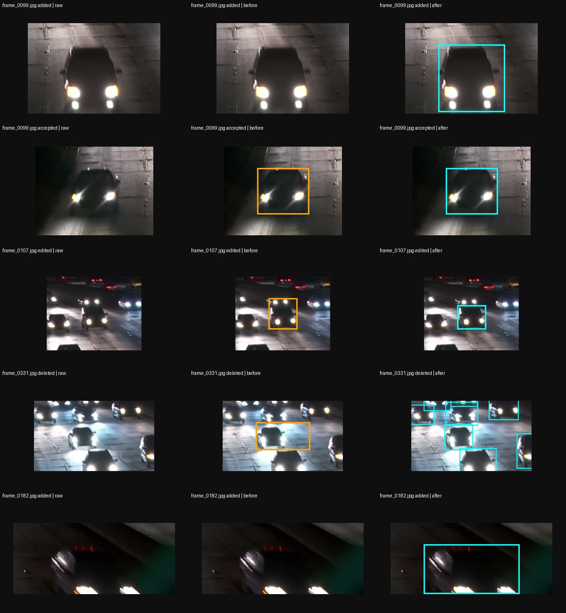
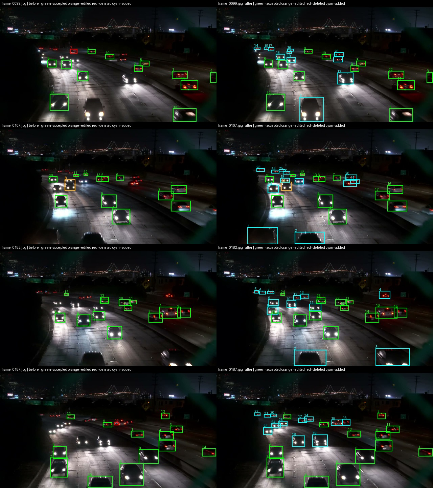
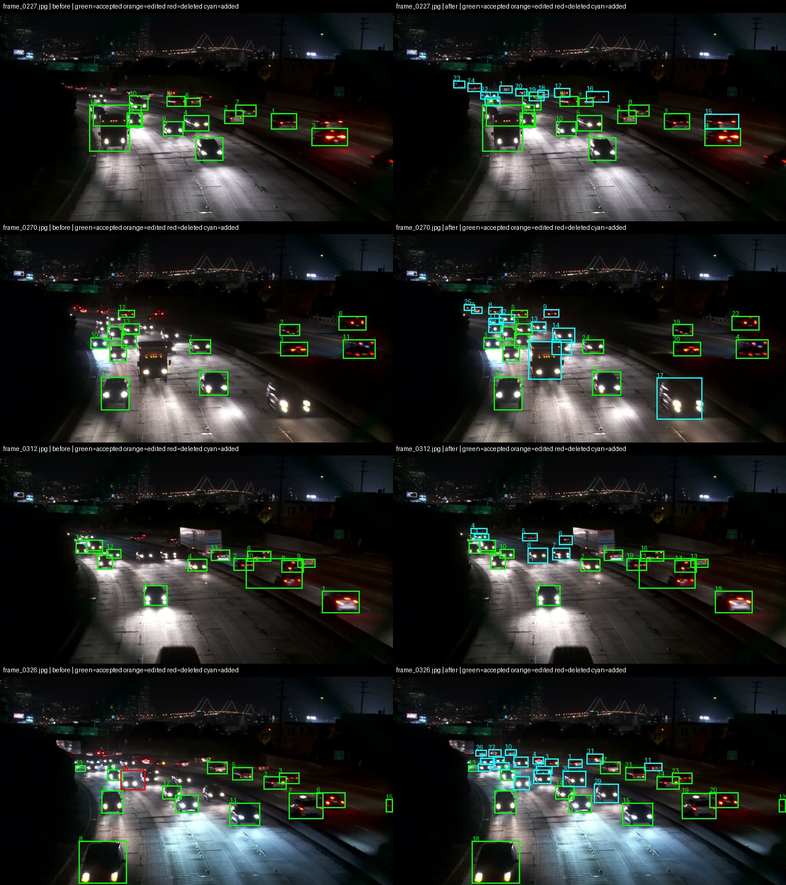
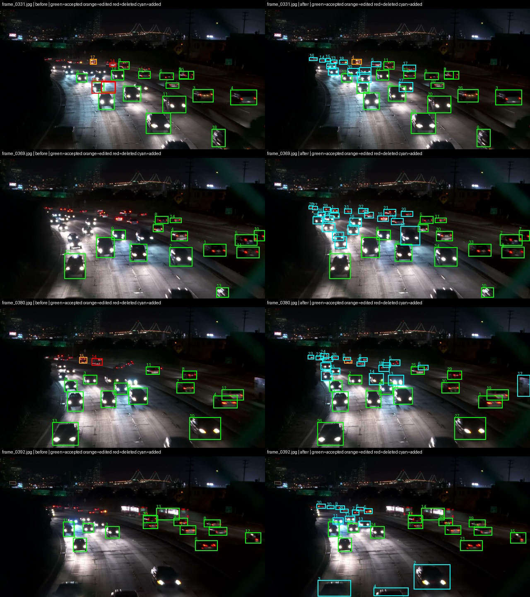

# Đối chiếu nhãn CVAT — bản cập nhật vòng 1

Nguồn: `day08/labels/train/`. Log do trợ lý tổng hợp sau export từ ảnh, pre-label và nhãn cuối; không phải nhật ký ghi đồng thời lúc học viên thao tác.

Có **12 ảnh, 321 box**. Kiểm định dạng class 0, tọa độ và tên ảnh đã đạt; không có ảnh test trong train. Phát hiện 8 box cao dưới 16 px và 0 cặp box có IoU > 0,85. Các phép kiểm kỹ thuật không bảo đảm nhãn đủ và đúng về ngữ nghĩa.

| Frame          | Hành động | Dòng trước → sau | Vật/vị trí và quy tắc kiểm                                                                                                                                                                                                                                                                                          |
| :------------- | :-------- | :--------------- | :------------------------------------------------------------------------------------------------------------------------------------------------------------------------------------------------------------------------------------------------------------------------------------------------------------------ |
| frame_0099.jpg | added     | — → 2            | Xe/vùng xe quanh tâm (562, 645) px; khung 141 × 143 px. Nhãn cuối có khung không ghép được với pre-label ở IoU 0,5. Kiểm thân xe nhìn thấy, không chỉ khoanh đèn hoặc vệt phản chiếu. Dòng pre-label — → dòng nhãn cuối 2. Đối chiếu hồi cứu sau export bằng trợ lý.                                                |
| frame_0099.jpg | accepted  | 12 → 12          | Xe/vùng xe quanh tâm (351, 604) px; khung 110 × 98 px. Khung được giữ gần như nguyên theo IoU ≥ 0,85. Giữ khung ôm thân xe, không kéo theo ánh sáng trên đường. Dòng pre-label 12 → dòng nhãn cuối 12. Đối chiếu hồi cứu sau export bằng trợ lý.                                                                    |
| frame_0107.jpg | edited    | 8 → 19           | Xe/vùng xe quanh tâm (414, 379) px; khung 61 × 51 px. Khung được điều chỉnh, IoU nằm trong khoảng 0,5 đến dưới 0,85. Kiểm độ khít thân xe và nguyên tắc một khung cho một xe. Dòng pre-label 8 → dòng nhãn cuối 19. Đối chiếu hồi cứu sau export bằng trợ lý.                                                       |
| frame_0331.jpg | deleted   | 16 → —           | Xe/vùng xe quanh tâm (500, 421) px; khung 116 × 59 px. Khung pre-label không còn cặp ghép ở IoU 0,5. Cần đối chiếu khung lân cận để phân biệt xóa khung dư với kéo khung đi xa; không tự kết luận mọi khung xóa đều là dự đoán sai. Dòng pre-label 16 → dòng nhãn cuối —. Đối chiếu hồi cứu sau export bằng trợ lý. |
| frame_0182.jpg | added     | — → 3            | Xe/vùng xe quanh tâm (1042, 667) px; khung 203 × 106 px. Nhãn cuối có khung không ghép được với pre-label ở IoU 0,5. Kiểm thân xe nhìn thấy, không chỉ khoanh đèn hoặc vệt phản chiếu. Dòng pre-label — → dòng nhãn cuối 3. Đối chiếu hồi cứu sau export bằng trợ lý.                                               |

## Thay đổi so với bản đã train trước

| File           | Số box bản trước | Số box hiện tại | Tọa độ thay đổi |
| :------------- | ---------------: | --------------: | :-------------- |
| frame_0099.txt | 23               | 23              | Không           |
| frame_0107.txt | 25               | 25              | Không           |
| frame_0182.txt | 25               | 25              | Không           |
| frame_0187.txt | 25               | 25              | Không           |
| frame_0227.txt | 24               | 24              | Không           |
| frame_0270.txt | 25               | 25              | Không           |
| frame_0312.txt | 19               | 19              | Không           |
| frame_0326.txt | 32               | 32              | Không           |
| frame_0331.txt | 30               | 30              | Không           |
| frame_0369.txt | 35               | 35              | Không           |
| frame_0380.txt | 32               | 32              | Không           |
| frame_0392.txt | 26               | 26              | Không           |

## Cách hiểu diff

`accepted`: IoU ≥ 0,85; `edited`: 0,5 ≤ IoU < 0,85. Ghép không dùng ID CVAT nên một box kéo xa có thể thành một deleted và một added. Added/deleted là thay đổi hình học so với pre-label, không phải số FN/FP thật so với nhãn người chuẩn. Không dùng số lượng box tăng để tự kết luận chất lượng nhãn tăng.

Quan sát tại [BLIND_SCAN.md](BLIND_SCAN.md) là ghi bổ sung sau CVAT; khóa hiện có chỉ bảo vệ bản ghi bổ sung, không chứng minh đúng thứ tự trước AI.

## Toàn bộ ảnh trước và sau

Xanh lá: accepted; cam: edited; đỏ: deleted; cyan: added. Số bên khung là số dòng nhãn, bắt đầu từ 1.

Bằng chứng tọa độ đầy đủ: [review_evidence_round1.json](../outputs/review_evidence_round1.json).
