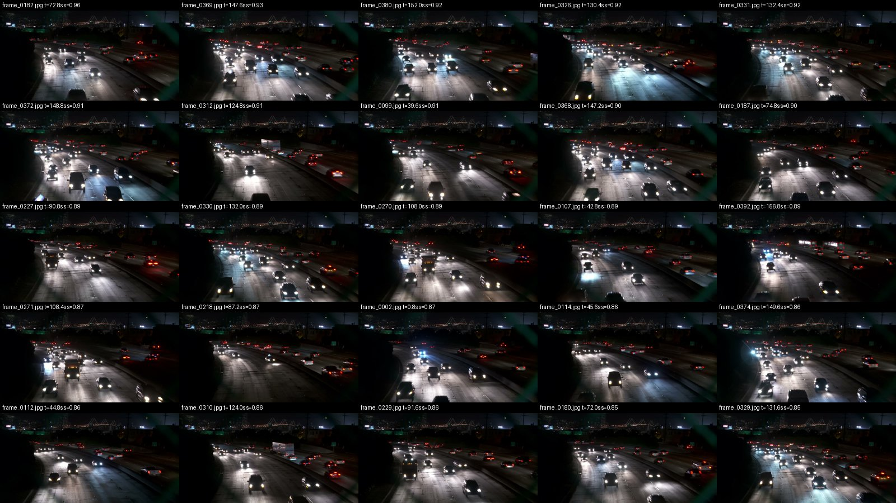
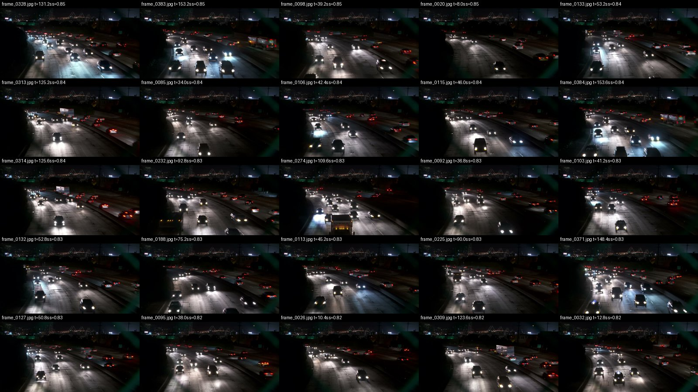

# Phân tích lựa chọn mẫu — vòng 1

| Thông tin                        | Giá trị                                                                  |
| :------------------------------- | :----------------------------------------------------------------------- |
| Nguồn số liệu                    | [selection_round1.csv](../outputs/selection_round1.csv), 268 ứng viên    |
| Phạm vi phân tích                | 50 ứng viên đứng đầu, rank 1–50                                          |
| Chiến lược thực chạy             | uncertainty, K = 12, khoảng cách tối thiểu 2 giây                        |
| Ngân sách giả định trong báo cáo | 5 ảnh; không thay thế lô 12 ảnh thực tế đã train                         |
| Thời điểm phân tích              | Sau khi nhận bản export CVAT; đây là phân tích hồi cứu từ dữ liệu vòng 0 |

## 1. Cách đọc điểm và giới hạn

`score = 0,5 × U + 0,3 × A + 0,2 × D`.

| Thành phần | Cách tính                                                              | Ý nghĩa khi chọn ảnh                                                             |
| :--------- | :--------------------------------------------------------------------- | :------------------------------------------------------------------------------- |
| U          | Trung bình tối đa 5 giá trị lớn nhất của `1 − abs(2 × confidence − 1)` | Cao khi model phân vân quanh confidence 0,5; không đo số xe bị bỏ sót hoàn toàn  |
| A          | Số box có `0,15 ≤ confidence < 0,5`, chia max trong pool               | Phản ánh khối lượng dự đoán mơ hồ; cảnh đông có thể tốn công rà                  |
| D          | Khoảng cách đến ảnh đã gán gần nhất, chặn 10 giây rồi chuẩn hóa        | Vòng 0 chưa có nhãn: tất cả D = 1, nên D không phân biệt ứng viên trong vòng này |
| MIN_GAP_S  | Tránh hai ảnh chọn trong cùng lô cách nhau dưới 2 giây                 | Giảm trùng trong lô, không bảo đảm khác xe hoặc khác bối cảnh hoàn toàn          |

`n_boxes` trong CSV đếm dự đoán confidence ≥ 0,05; pre-label dùng confidence ≥ 0,25 nên hai số không bằng nhau. Không dùng n_boxes làm số xe thật. Trong top 50 không có dòng `empty=True`; do đó không bịa ví dụ ảnh model không dự đoán được box. Script có thưởng 0,5 cho trường hợp empty, nhưng không áp dụng cho 50 dòng ở đây.

## 2. Top 5 đề xuất nếu chỉ rà được năm ảnh

Ưu tiên bất định cao nhưng trải đều thời gian và có kiểu xe/điều kiện khó khác nhau. Chi phí dưới đây là ước lượng tương đối từ ảnh và CSV, không phải thời gian thao tác đã đo.

**Thứ tự ưu tiên và điểm chọn mẫu**

| Ưu tiên | Frame          | Rank gốc | Thời điểm (s) | Score  |
| ------: | :------------- | -------: | ------------: | -----: |
| 1       | frame_0182.jpg | 1        | 72.8          | 0.9591 |
| 2       | frame_0369.jpg | 2        | 147.6         | 0.9324 |
| 3       | frame_0326.jpg | 4        | 130.4         | 0.9155 |
| 4       | frame_0099.jpg | 8        | 39.6          | 0.9063 |
| 5       | frame_0270.jpg | 13       | 108.0         | 0.8878 |

**Lý do lựa chọn và công rà nhãn**

| Ưu tiên | Frame          | Lý do                                                                                            | Công rà dự kiến               |
| ------: | :------------- | :----------------------------------------------------------------------------------------------- | :---------------------------- |
| 1       | frame_0182.jpg | Điểm cao nhất; xe tối và xe cắt mép dưới. Ưu tiên kiểm thiếu xe trước khi kéo box.               | Cao: 18 box mơ hồ             |
| 2       | frame_0369.jpg | Cảnh đông xe, đèn pha chói và nhiều kích thước; đại diện cụm cuối video.                         | Cao: 43 dự đoán, 16 mơ hồ     |
| 3       | frame_0326.jpg | Dòng xe dày, vệt phản chiếu mạnh; cách 0369 tới 17,2 giây nên ít trùng hơn chọn 0380.            | Cao: 39 dự đoán, 15 mơ hồ     |
| 4       | frame_0099.jpg | U=0,9460 cao; mở rộng về đoạn 39,6 giây, có xe lớn gần đáy ảnh và xe đi xa phía phải.            | Vừa: 29 dự đoán, 14 mơ hồ     |
| 5       | frame_0270.jpg | Có xe tải/xe thân cao giữa dòng xe; bổ sung đoạn 108 giây, tránh dồn ngân sách vào 130–152 giây. | Vừa–cao: 35 dự đoán, 14 mơ hồ |

Các thời điểm khi sắp tăng dần là **39,6; 72,8; 108,0; 130,4; 147,6 giây**; khoảng cách nhỏ nhất **17,2 giây**. Đây là lựa chọn có chủ đích rộng thời gian hơn top 5 thuần score, không phải kết quả thử nghiệm chứng minh năm ảnh này tốt hơn.

## 3. Ba ảnh model chọn và một ảnh không chọn

| Frame          | U / A / D                | Score  | Quyết định model | Bằng chứng và cách cân nhắc                                                                                                                                      |
| :------------- | :----------------------- | -----: | :--------------- | :--------------------------------------------------------------------------------------------------------------------------------------------------------------- |
| frame_0182.jpg | 0,9182 / 1,0000 / 1,0000 | 0,9591 | Chọn             | Rank 1; 18 box mơ hồ. Ảnh có thân xe tối sát mép dưới, nguy cơ model bỏ sót dù vùng đèn nổi bật. Công rà không chỉ là chấp nhận box có sẵn.                      |
| frame_0369.jpg | 0,9315 / 0,8889 / 1,0000 | 0,9324 | Chọn             | Rank 2; 43 dự đoán và 16 box mơ hồ. Cảnh đông, nhiều đèn và xe che nhau; cần phóng to cụm xa.                                                                    |
| frame_0326.jpg | 0,9310 / 0,8333 / 1,0000 | 0,9155 | Chọn             | Rank 4; 39 dự đoán. Vệt đèn xanh/trắng trên mặt đường không được tính vào thân xe. Ảnh 0331 chỉ cách 2 giây nên có thể cùng xe, dù cả hai đều vượt luật min-gap. |
| frame_0372.jpg | 0,9202 / 0,8333 / 1,0000 | 0,9101 | Không chọn       | Rank 6 nhưng chỉ cách 0369 **1,2 giây**, dưới 2 giây. Hai ảnh cùng đoạn cuối, dòng xe tương tự; bỏ 0372 giúp dành công cho đoạn khác.                            |

Với ngân sách năm ảnh, còn bỏ **0380** (rank 3) vì chỉ cách 0369 4,4 giây, và **0331** (rank 5) vì cách 0326 2 giây. Đây là quyết định cân nhắc công rà, chặt hơn luật chọn lô mặc định. **0270** (rank 13) được ưu tiên nhờ khoảng thời gian khác và xe thân cao, dù score thấp hơn.

## 4. Bảng kiểm đủ 50 ứng viên

**Thứ hạng, thời điểm và quyết định chọn mẫu**

| Rank | Frame          | t (s) | Score  | Lô 12 | Top 5 đề xuất |
| ---: | :------------- | ----: | -----: | :---- | :------------ |
| 1    | frame_0182.jpg | 72.8  | 0.9591 | Có    | Có            |
| 2    | frame_0369.jpg | 147.6 | 0.9324 | Có    | Có            |
| 3    | frame_0380.jpg | 152.0 | 0.917  | Có    | —             |
| 4    | frame_0326.jpg | 130.4 | 0.9155 | Có    | Có            |
| 5    | frame_0331.jpg | 132.4 | 0.9154 | Có    | —             |
| 6    | frame_0372.jpg | 148.8 | 0.9101 | —     | —             |
| 7    | frame_0312.jpg | 124.8 | 0.91   | Có    | —             |
| 8    | frame_0099.jpg | 39.6  | 0.9063 | Có    | Có            |
| 9    | frame_0368.jpg | 147.2 | 0.9003 | —     | —             |
| 10   | frame_0187.jpg | 74.8  | 0.8995 | Có    | —             |
| 11   | frame_0227.jpg | 90.8  | 0.8915 | Có    | —             |
| 12   | frame_0330.jpg | 132.0 | 0.8899 | —     | —             |
| 13   | frame_0270.jpg | 108.0 | 0.8878 | Có    | Có            |
| 14   | frame_0107.jpg | 42.8  | 0.8876 | Có    | —             |
| 15   | frame_0392.jpg | 156.8 | 0.8874 | Có    | —             |
| 16   | frame_0271.jpg | 108.4 | 0.8675 | —     | —             |
| 17   | frame_0218.jpg | 87.2  | 0.8669 | —     | —             |
| 18   | frame_0002.jpg | 0.8   | 0.8658 | —     | —             |
| 19   | frame_0114.jpg | 45.6  | 0.8625 | —     | —             |
| 20   | frame_0374.jpg | 149.6 | 0.8624 | —     | —             |
| 21   | frame_0112.jpg | 44.8  | 0.8612 | —     | —             |
| 22   | frame_0310.jpg | 124.0 | 0.8601 | —     | —             |
| 23   | frame_0229.jpg | 91.6  | 0.8551 | —     | —             |
| 24   | frame_0180.jpg | 72.0  | 0.8539 | —     | —             |
| 25   | frame_0329.jpg | 131.6 | 0.8523 | —     | —             |
| 26   | frame_0328.jpg | 131.2 | 0.8491 | —     | —             |
| 27   | frame_0383.jpg | 153.2 | 0.8482 | —     | —             |
| 28   | frame_0098.jpg | 39.2  | 0.8474 | —     | —             |
| 29   | frame_0020.jpg | 8.0   | 0.8451 | —     | —             |
| 30   | frame_0133.jpg | 53.2  | 0.8448 | —     | —             |
| 31   | frame_0313.jpg | 125.2 | 0.8433 | —     | —             |
| 32   | frame_0085.jpg | 34.0  | 0.8414 | —     | —             |
| 33   | frame_0106.jpg | 42.4  | 0.8394 | —     | —             |
| 34   | frame_0115.jpg | 46.0  | 0.8366 | —     | —             |
| 35   | frame_0384.jpg | 153.6 | 0.8365 | —     | —             |
| 36   | frame_0314.jpg | 125.6 | 0.8357 | —     | —             |
| 37   | frame_0232.jpg | 92.8  | 0.8339 | —     | —             |
| 38   | frame_0274.jpg | 109.6 | 0.8317 | —     | —             |
| 39   | frame_0092.jpg | 36.8  | 0.8297 | —     | —             |
| 40   | frame_0103.jpg | 41.2  | 0.8296 | —     | —             |
| 41   | frame_0132.jpg | 52.8  | 0.8296 | —     | —             |
| 42   | frame_0188.jpg | 75.2  | 0.8288 | —     | —             |
| 43   | frame_0113.jpg | 45.2  | 0.8285 | —     | —             |
| 44   | frame_0225.jpg | 90.0  | 0.8276 | —     | —             |
| 45   | frame_0371.jpg | 148.4 | 0.8271 | —     | —             |
| 46   | frame_0127.jpg | 50.8  | 0.8262 | —     | —             |
| 47   | frame_0095.jpg | 38.0  | 0.8239 | —     | —             |
| 48   | frame_0026.jpg | 10.4  | 0.8215 | —     | —             |
| 49   | frame_0309.jpg | 123.6 | 0.8211 | —     | —             |
| 50   | frame_0032.jpg | 12.8  | 0.8203 | —     | —             |

**Các thành phần điểm U, A và D**

| Rank | Frame          | U      | A      | D   |
| ---: | :------------- | -----: | -----: | --: |
| 1    | frame_0182.jpg | 0.9182 | 1.0    | 1.0 |
| 2    | frame_0369.jpg | 0.9315 | 0.8889 | 1.0 |
| 3    | frame_0380.jpg | 0.934  | 0.8333 | 1.0 |
| 4    | frame_0326.jpg | 0.931  | 0.8333 | 1.0 |
| 5    | frame_0331.jpg | 0.8308 | 1.0    | 1.0 |
| 6    | frame_0372.jpg | 0.9202 | 0.8333 | 1.0 |
| 7    | frame_0312.jpg | 0.8199 | 1.0    | 1.0 |
| 8    | frame_0099.jpg | 0.946  | 0.7778 | 1.0 |
| 9    | frame_0368.jpg | 0.9339 | 0.7778 | 1.0 |
| 10   | frame_0187.jpg | 0.8324 | 0.9444 | 1.0 |
| 11   | frame_0227.jpg | 0.9164 | 0.7778 | 1.0 |
| 12   | frame_0330.jpg | 0.8465 | 0.8889 | 1.0 |
| 13   | frame_0270.jpg | 0.9089 | 0.7778 | 1.0 |
| 14   | frame_0107.jpg | 0.8752 | 0.8333 | 1.0 |
| 15   | frame_0392.jpg | 0.9747 | 0.6667 | 1.0 |
| 16   | frame_0271.jpg | 0.835  | 0.8333 | 1.0 |
| 17   | frame_0218.jpg | 0.8671 | 0.7778 | 1.0 |
| 18   | frame_0002.jpg | 0.8983 | 0.7222 | 1.0 |
| 19   | frame_0114.jpg | 0.8917 | 0.7222 | 1.0 |
| 20   | frame_0374.jpg | 0.9247 | 0.6667 | 1.0 |
| 21   | frame_0112.jpg | 0.9224 | 0.6667 | 1.0 |
| 22   | frame_0310.jpg | 0.9201 | 0.6667 | 1.0 |
| 23   | frame_0229.jpg | 0.9102 | 0.6667 | 1.0 |
| 24   | frame_0180.jpg | 0.9745 | 0.5556 | 1.0 |
| 25   | frame_0329.jpg | 0.8712 | 0.7222 | 1.0 |
| 26   | frame_0328.jpg | 0.9316 | 0.6111 | 1.0 |
| 27   | frame_0383.jpg | 0.863  | 0.7222 | 1.0 |
| 28   | frame_0098.jpg | 0.9281 | 0.6111 | 1.0 |
| 29   | frame_0020.jpg | 0.8902 | 0.6667 | 1.0 |
| 30   | frame_0133.jpg | 0.8896 | 0.6667 | 1.0 |
| 31   | frame_0313.jpg | 0.92   | 0.6111 | 1.0 |
| 32   | frame_0085.jpg | 0.8495 | 0.7222 | 1.0 |
| 33   | frame_0106.jpg | 0.8787 | 0.6667 | 1.0 |
| 34   | frame_0115.jpg | 0.8399 | 0.7222 | 1.0 |
| 35   | frame_0384.jpg | 0.8397 | 0.7222 | 1.0 |
| 36   | frame_0314.jpg | 0.9048 | 0.6111 | 1.0 |
| 37   | frame_0232.jpg | 0.8677 | 0.6667 | 1.0 |
| 38   | frame_0274.jpg | 0.93   | 0.5556 | 1.0 |
| 39   | frame_0092.jpg | 0.8927 | 0.6111 | 1.0 |
| 40   | frame_0103.jpg | 0.8926 | 0.6111 | 1.0 |
| 41   | frame_0132.jpg | 0.9258 | 0.5556 | 1.0 |
| 42   | frame_0188.jpg | 0.791  | 0.7778 | 1.0 |
| 43   | frame_0113.jpg | 0.857  | 0.6667 | 1.0 |
| 44   | frame_0225.jpg | 0.9553 | 0.5    | 1.0 |
| 45   | frame_0371.jpg | 0.8542 | 0.6667 | 1.0 |
| 46   | frame_0127.jpg | 0.8858 | 0.6111 | 1.0 |
| 47   | frame_0095.jpg | 0.9145 | 0.5556 | 1.0 |
| 48   | frame_0026.jpg | 0.7763 | 0.7778 | 1.0 |
| 49   | frame_0309.jpg | 0.8756 | 0.6111 | 1.0 |
| 50   | frame_0032.jpg | 0.874  | 0.6111 | 1.0 |

**Số dự đoán và mức độ mơ hồ**

| Rank | Frame          | Box ≥0,05 | Mơ hồ |
| ---: | :------------- | --------: | ----: |
| 1    | frame_0182.jpg | 28        | 18    |
| 2    | frame_0369.jpg | 43        | 16    |
| 3    | frame_0380.jpg | 40        | 15    |
| 4    | frame_0326.jpg | 39        | 15    |
| 5    | frame_0331.jpg | 47        | 18    |
| 6    | frame_0372.jpg | 42        | 15    |
| 7    | frame_0312.jpg | 37        | 18    |
| 8    | frame_0099.jpg | 29        | 14    |
| 9    | frame_0368.jpg | 33        | 14    |
| 10   | frame_0187.jpg | 39        | 17    |
| 11   | frame_0227.jpg | 37        | 14    |
| 12   | frame_0330.jpg | 53        | 16    |
| 13   | frame_0270.jpg | 35        | 14    |
| 14   | frame_0107.jpg | 33        | 15    |
| 15   | frame_0392.jpg | 35        | 12    |
| 16   | frame_0271.jpg | 37        | 15    |
| 17   | frame_0218.jpg | 33        | 14    |
| 18   | frame_0002.jpg | 27        | 13    |
| 19   | frame_0114.jpg | 30        | 13    |
| 20   | frame_0374.jpg | 34        | 12    |
| 21   | frame_0112.jpg | 30        | 12    |
| 22   | frame_0310.jpg | 40        | 12    |
| 23   | frame_0229.jpg | 27        | 12    |
| 24   | frame_0180.jpg | 31        | 10    |
| 25   | frame_0329.jpg | 47        | 13    |
| 26   | frame_0328.jpg | 39        | 11    |
| 27   | frame_0383.jpg | 32        | 13    |
| 28   | frame_0098.jpg | 31        | 11    |
| 29   | frame_0020.jpg | 24        | 12    |
| 30   | frame_0133.jpg | 31        | 12    |
| 31   | frame_0313.jpg | 28        | 11    |
| 32   | frame_0085.jpg | 24        | 13    |
| 33   | frame_0106.jpg | 31        | 12    |
| 34   | frame_0115.jpg | 30        | 13    |
| 35   | frame_0384.jpg | 35        | 13    |
| 36   | frame_0314.jpg | 38        | 11    |
| 37   | frame_0232.jpg | 43        | 12    |
| 38   | frame_0274.jpg | 24        | 10    |
| 39   | frame_0092.jpg | 30        | 11    |
| 40   | frame_0103.jpg | 27        | 11    |
| 41   | frame_0132.jpg | 30        | 10    |
| 42   | frame_0188.jpg | 39        | 14    |
| 43   | frame_0113.jpg | 33        | 12    |
| 44   | frame_0225.jpg | 35        | 9     |
| 45   | frame_0371.jpg | 34        | 12    |
| 46   | frame_0127.jpg | 28        | 11    |
| 47   | frame_0095.jpg | 25        | 10    |
| 48   | frame_0026.jpg | 31        | 14    |
| 49   | frame_0309.jpg | 31        | 11    |
| 50   | frame_0032.jpg | 31        | 11    |

### Ảnh đối chiếu

## 5. Điều phép chọn chưa chứng minh

Điểm bất định không chứng minh ảnh sẽ làm AP50 tăng: model có thể tự tin nhưng sai hoặc bỏ sót xe không sinh box, còn ảnh mơ hồ có thể do ánh sáng chứ không cung cấp thông tin mới. Chỉ có một lô và một seed, chưa có đối chứng random cùng ngân sách, chưa đo thời gian rà thực tế. Các frame đều từ một camera ban đêm; trải thời gian không đồng nghĩa đa dạng camera/thời tiết. Kết quả phải được kiểm trên tập test cố định và diễn giải theo giới hạn nhãn tham chiếu do model tạo.
